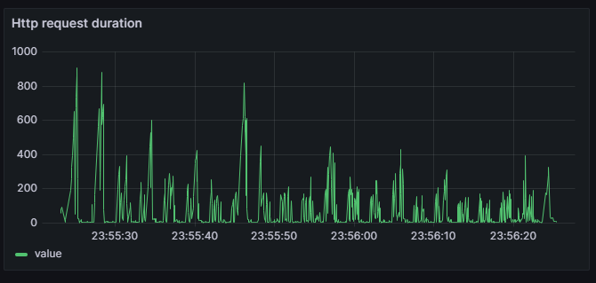
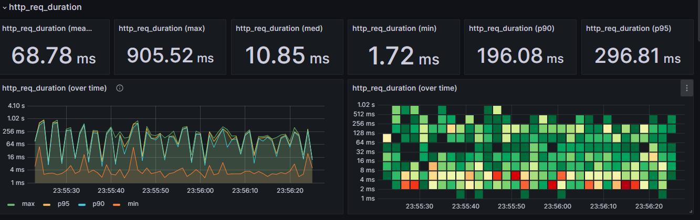
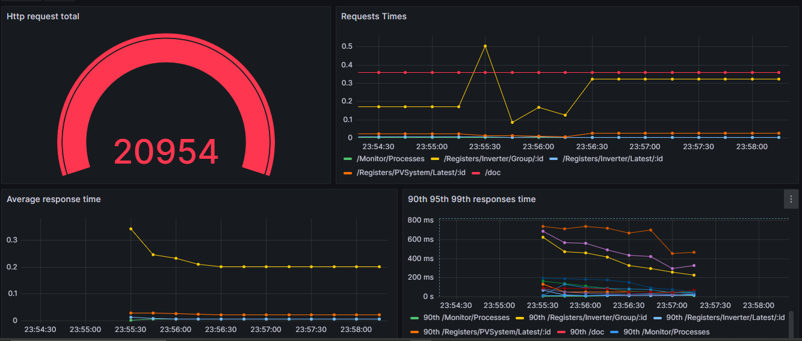
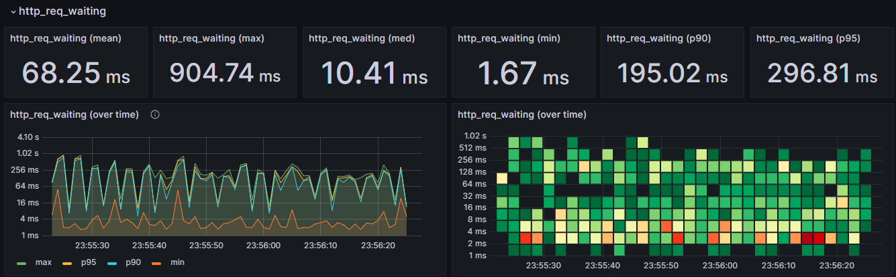
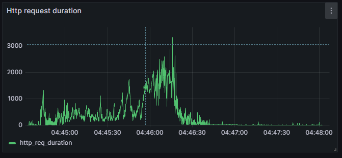
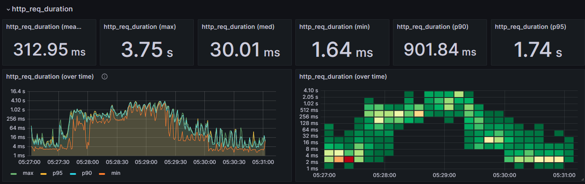
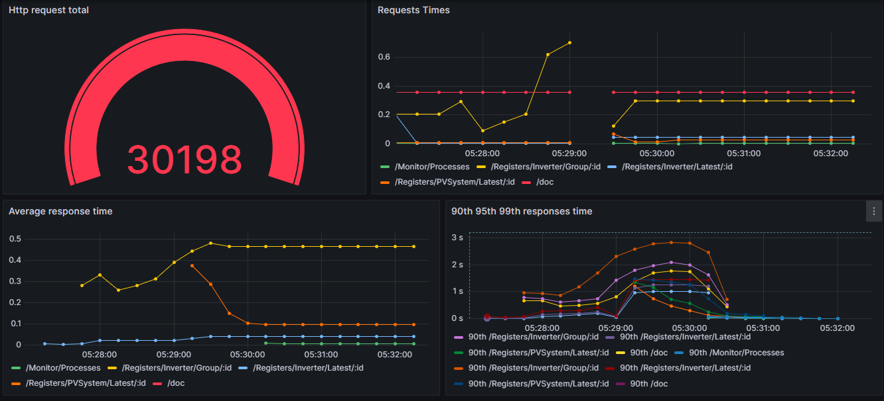
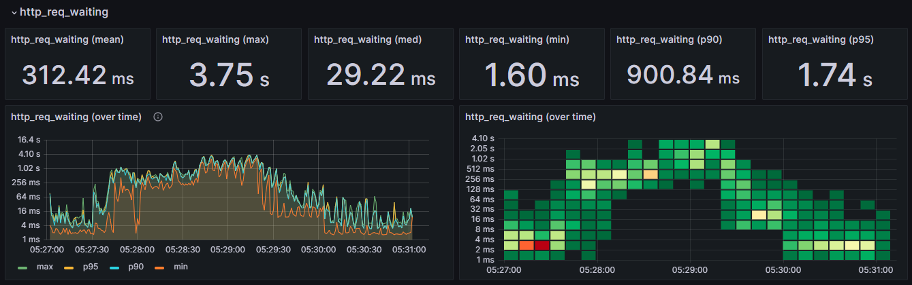

# Teste de Avaliação de Desempenho da API PVSIM em Node.js

## 1. Definição do Estudo

### a. Qual o cenário e o problema a ser estudado.
A API em questão é responsável por processar requisições de monitoramento de dados de inversores fotovoltaicos, servindo para coletar, processar e armazenar informações periodicamente. O problema envolve avaliar o desempenho da API, identificar gargalos e otimizar o tempo de resposta, considerando que a aplicação deve suportar concorrência de usuários.

### b. Definição do escopo. Que partes do sistema serão estudadas, qual o nível de detalhes?
- **Sistema a ser estudado**: API responsável pelo processamento de registros de inversores.
- **Partes analisadas**: Endpoints principais, como:
`/api/registers/inverter/latest/`
`/api/Registers/Inverter/Group/`
`/api/monitor/processes/`
- **Nível de Detalhes**: O estudo será focado nas métricas de tempo de resposta (http_req_duration) e suas subdivisões (blocked, connecting, receiving, sending, waiting), detalhando o tempo de execução, o tráfego de rede, e as condições de concorrência.

### c. Quais os objetivos do estudo?
- Analisar o tempo de resposta das requisições em diferentes endpoints.
- Identificar gargalos no processo de conexão, bloqueio de requisições e espera por resposta.
- Estudar o comportamento da API sob carga.

### d. Que métricas serão utilizadas para avaliar o desempenho?
- **http_req_duration** (Tempo total de resposta).
- **http_req_blocked** (Tempo bloqueado aguardando o slot de execução).
- **http_req_connecting** (Tempo de estabelecimento de conexão TCP).
- **http_req_receiving** (Tempo de recebimento de dados).
- **http_req_sending** (Tempo de envio da requisição).
- **http_req_waiting** (Tempo de espera pela resposta após o envio).
  
## 2. Aferição

### a. Qual monitor será utilizado para aferição? Será um disponível na Internet ou será implementado?
O monitoramento foi realizado usando K6 como ferramenta de teste de carga, prom-client como exportador para o prometheus, InfluxDB para armazenar métricas do k6 e Grafana para visualização. As ferramentas foram configuradas para coletar métricas como tempo de requisição, conectividade, dados de bloqueio, uso de CPU, memória e etc.

### b. Realizar a aferição:

#### i. Execução
O teste de carga foi executado por 1 minuto com 10 usuários virtuais simultâneos (VUs), simulando múltiplas requisições às rotas da API.
  
#### ii. Coleta de métricas
As métricas foram coletadas de forma contínua durante os testes de carga, incluindo duração total das requisições (http_req_duration) e seus subcomponentes como http_req_blocked, http_req_connecting, etc.

#### iii. Estatísticas descritivas
Aqui estão algumas estatísticas geradas pelo K6:

| metrica    | média | min  | mediana | max    | p90    | p95    |
| ---------- | ----- | ---- | ------- | ------ | ------ | ------ |
| duração    | 68.78 | 1.72 | 10.85   | 905.52 | 196.08 | 296.81 |
| espera     | 68.78 | 1.67 | 10.41   | 904.74 | 195.02 | 296.81 |
| conectando | 0.04  | 5.54 | 0       | 2      | 0      | 0      |

```sh
    execution: local
      script: index.js
      output: InfluxDBv1 (http://localhost:8086)

     scenarios: (100.00%) 1 scenario, 10 max VUs, 1m30s max duration (incl. graceful stop):
              * default: 10 looping VUs for 1m0s (gracefulStop: 30s)

  ✓ checks.........................: 100.00% 2140 out of 2140
    data_received..................: 24 MB   388 kB/s
    data_sent......................: 244 kB  3.9 kB/s
    group_duration.................: avg=573.82ms min=502.26ms med=514.85ms max=1.4s     p(90)=707.32ms p(95)=807.07ms
    http_req_blocked...............: avg=100.82µs min=0s       med=0s       max=13.59ms  p(90)=0s       p(95)=0s
    http_req_connecting............: avg=37.44µs  min=0s       med=0s       max=5.54ms   p(90)=0s       p(95)=0s
  ✗ http_req_duration..............: avg=68.86ms  min=1.71ms   med=11ms     max=905.51ms p(90)=195.56ms p(95)=294.53ms
      { expected_response:true }...: avg=68.86ms  min=1.71ms   med=11ms     max=905.51ms p(90)=195.56ms p(95)=294.53ms
    http_req_failed................: 0.00%   0 out of 1070
    http_req_receiving.............: avg=498.96µs min=0s       med=151.1µs  max=36.43ms  p(90)=997.8µs  p(95)=1ms
    http_req_sending...............: avg=32.11µs  min=0s       med=0s       max=4.48ms   p(90)=0s       p(95)=0s
    http_req_tls_handshaking.......: avg=0s       min=0s       med=0s       max=0s       p(90)=0s       p(95)=0s
    http_req_waiting...............: avg=68.33ms  min=1.67ms   med=10.63ms  max=904.73ms p(90)=193.74ms p(95)=294.53ms
    http_reqs......................: 1070    17.035922/s
    iteration_duration.............: avg=2.87s    min=2.6s     med=2.82s    max=3.64s    p(90)=3.15s    p(95)=3.3s
    iterations.....................: 214     3.407184/s
    vus............................: 4       min=4            max=10
    vus_max........................: 10      min=10           max=10

```


##### Principais Métricas 
###### Checks
- **checks: 100.00% 2140 out of 2140**: Todas as verificações programadas foram aprovadas, ou seja, 2140 de 2140 checks tiveram sucesso.
###### Dados Recebidos e Enviados
**data_received: 24 MB**: A quantidade total de dados recebidos foi de 24 MB, a uma taxa de 388 kB/s.
**data_sent: 244 kB**: A quantidade total de dados enviados foi de 244 kB, a uma taxa de 3.9 kB/s.

###### Group Duration
- **group_duration: avg=573.82ms min=502.26ms med=514.85ms max=1.4s p(90)=707.32ms p(95)=807.07ms**: O tempo de execução dos grupos de requisições. Isso mostra:
  - **avg**: A duração média de cada grupo foi de 573.82ms.
  - **min / max**: A duração mínima foi de 502.26ms e a máxima de 1.4s.
  - **med**: O valor mediano foi 514.85ms.
  - **p(90) / p(95)**: 90% das requisições foram concluídas em até 707.32ms, e 95% em até 807.07ms.

###### http_req_duration
- **http_req_duration: avg=68.86ms min=1.71ms med=11ms max=905.51ms p(90)=195.56ms p(95)=294.53ms**: Esta métrica mede o tempo total de uma requisição, desde o momento em que ela é iniciada até a resposta completa.
  - **avg**: A média foi de 68.86ms.
  - **min / max**: O menor tempo de resposta foi 1.71ms e o maior foi 905.51ms.
  - **med**: O valor mediano foi 11ms.
  - **p(90) / p(95)**: 90% das requisições foram concluídas em até 195.56ms, e 95% em até 294.53ms.
  
###### http_req_waiting
- **http_req_waiting: avg=68.33ms min=1.67ms med=10.63ms max=904.73ms p(90)=193.74ms p(95)=294.53ms**: O tempo de espera pela resposta do servidor.
  - O tempo médio de espera foi 68.33ms, com a maior parte das requisições tendo uma espera de até 10.63ms (mediana).

###### http_reqs
- **http_reqs: 1070**: O número total de requisições feitas durante o teste foi de 1070.


#### iv. Intervalo de confiança
[**Código em R com dados brutos**](https://colab.research.google.com/drive/1geUQGEj32COAAf6LJplfXkHzdXG7SHaH?usp=sharing):


```r
# Carregar os dados do arquivo CSV
req_duration <- read.csv('/content/req_duration.csv')
head(req_duration)
# Calcular a média e o desvio padrão
media <- mean(req_duration$value, na.rm = TRUE)
desvio_padrao <- sd(req_duration$value, na.rm = TRUE)

cat("mean:", media, "\n")
cat("stddev:", desvio_padrao, "\n")

# Calcular o intervalo de confiança
confidence_level <- 0.95
n <- length(req_duration$value)
sem <- desvio_padrao / sqrt(n)
error_margin <- qt((1 - confidence_level) / 2, df = n - 1, lower.tail = FALSE) * sem
lower_bound <- media - error_margin
upper_bound <- media + error_margin

cat("confidence interval:", lower_bound, "a", upper_bound, "\n")

# Estatísticas descritivas
descricao <- summary(req_duration$value)
print(descricao)
```

**Saída**

```sh
A data.frame: 6 × 2
                   Time	 value
                  <chr>  <dbl>
1	2024-10-21   23:55:23  	57.9
2	2024-10-21   23:55:23  	65.5
3	2024-10-21   23:55:23  	70.3
4	2024-10-21   23:55:23  	79.1
5	2024-10-21   23:55:23  	82.0
6	2024-10-21   23:55:23  	84.2
mean: 68.78585 
stddev: 123.6315 
confidence interval: 61.34529 a 76.22642 
  Min. 1st Qu.  Median    Mean 3rd Qu.    Max. 
  1.72    4.13   10.90   68.79   90.50  906.00 
```

**Código em python (usando o percentil)**

```python
import math
from scipy import stats

# Dados fornecidos pelo K6
media = 68.86  # média em ms
p90 = 195.56  # percentil 90
p95 = 294.53  # percentil 95
n = 1070  # número de requisições

# Estimativa aproximada do desvio padrão a partir do p95 (opcional)
desvio_padrao = (p95 - media) / 1.645  # p95 corresponde a 1.645 desvios padrão

# Nível de confiança (95%)
z = stats.norm.ppf(0.975)  # 1.96 para 95% de confiança

# Cálculo do intervalo de confiança
margem_erro = z * (desvio_padrao / math.sqrt(n))
ic_inferior = media - margem_erro
ic_superior = media + margem_erro

print(ic_inferior, ic_superior)
```

**saida**
```sh
60.64014552551493 77.07985447448507
```

---

# Graficos das Métricas 

## Duração das requisições


### Métricas Gerais


#### Detalhada


## Tempo de Espera das requisições


---

## 3. Simulação

### a. Simulador
- **K6**

### b. Modelar o sistema
- **Usei uma simulação mais pesada, colocando 28 vus, acessando em tempos diferentes, em diferentes cenários com diferenctes rotas**
- **Usuários Virtuais (Virtual Users - VUs)**: Simular diferentes quantidades de usuários que fazem requisições simultâneas.
- **Perfil de Carga**: Diferentes perfis de carga, aumento gradual de usuários (ramp-up) e uma carga constante por um período de tempo.

### c, d, e. Simulação

**Simulador**
```javascript
import http from 'k6/http';
import { group, check, sleep } from 'k6';
import { Trend, Rate } from 'k6/metrics';

// Definindo métricas customizadas
const inverterGroupDuration = new Trend('inverter_group_duration');
const inverterGroupSuccessRate = new Rate('inverter_group_success_rate');

const inverterLatestWithParamsDuration = new Trend('inverter_latest_with_params_duration');
const inverterLatestWithParamsSuccessRate = new Rate('inverter_latest_with_params_success_rate');

const inverterLatestDuration = new Trend('inverter_latest_duration');
const inverterLatestSuccessRate = new Rate('inverter_latest_success_rate');

const systemLatestDuration = new Trend('system_latest_duration');
const systemLatestSuccessRate = new Rate('system_latest_success_rate');

const monitorDuration = new Trend('monitor_duration');
const monitorSuccessRate = new Rate('monitor_success_rate');

export let options = {
    scenarios: {
        inverter_latest: {
            executor: 'constant-vus',
            vus: 10,
            duration: '1m',
            exec: 'testInverterLatest',
            startTime: '0s',
        },
        inverter_group: {
            executor: 'ramping-vus',
            startVUs: 5,
            stages: [
                { duration: '1m', target: 15 },
                { duration: '30s', target: 15 },
                { duration: '30s', target: 0 },
            ],
            exec: 'testInverterGroup',
            startTime: '40s',
        },
        inverter_latest_with_params: {
            executor: 'per-vu-iterations',
            vus: 5,
            iterations: 10,
            exec: 'testInverterLatestWithParams',
            startTime: '2m',
        },
        pv_system_latest: {
            executor: 'constant-arrival-rate',
            rate: 20,
            timeUnit: '1s',
            duration: '1m',
            preAllocatedVUs: 7,
            maxVUs: 8,
            exec: 'testPVSystemLatest',
            startTime: '2m',
        },
        monitor_processes: {
            executor: 'constant-vus',
            vus: 6,
            duration: '1m',
            exec: 'testMonitorProcesses',
            startTime: '3m',
        },
    },
    thresholds: {
        'http_req_duration': ['p(95)<200', 'p(99)<300'], // Threshold geral de latência
        'checks': ['rate>0.95'], // 95% dos checks bem-sucedidos
        'inverter_group_duration': ['p(90)<150', 'p(95)<200', 'p(99)<250'], // Rota crítica: mais rigorosa
        'inverter_group_success_rate': ['rate>0.98'], // Exige ao menos 98% de sucesso
    },
};

// Funções específicas para cada cenário
export function testInverterLatest() {
    group('Get latest inverter registers', () => {
        const res = http.get('http://localhost:3000/api/registers/inverter/latest/66082b7665c3d00760c2b7a2');

        // Checar status e tempo de resposta
        const isSuccess = check(res, {
            'Status 304 ou 200': (r) => r.status === 304 || r.status === 200,
            'Tempo de resposta < 500ms': (r) => r.timings.duration < 500,
        });

        // Registrar métricas personalizadas para a rota crítica
        inverterLatestDuration.add(res.timings.duration);
        inverterLatestSuccessRate.add(isSuccess);
        sleep(0.5);
    });
}

export function testInverterGroup() {
    group('Get inverter group data', () => {
        const res = http.get('http://localhost:3000/api/Registers/Inverter/Group/66082b7665c3d00760c2b7a2?select=Timestamp,Today_s_PV_Generation,PV_Power,Total_PV_Generation,Bus_Voltage,NBus_Voltage&group=PV$_Voltage-PV_s_Voltages,PV$_Current-PV_s_Currents,PV$_Power-PV_s_Powers');
        
        // Checar status e tempo de resposta
        const isSuccess = check(res, {
            'Status 304 ou 200': (r) => r.status === 304 || r.status === 200,
            'Tempo de resposta < 500ms': (r) => r.timings.duration < 500,
        });

        // Registrar métricas personalizadas para a rota crítica
        inverterGroupDuration.add(res.timings.duration);
        inverterGroupSuccessRate.add(isSuccess);
        sleep(0.5);
    });
}

export function testInverterLatestWithParams() {
    group('Get latest inverter registers with query params', () => {
        const res = http.get('http://localhost:3000/api/Registers/Inverter/Latest/66082b7665c3d00760c2b7a2?group=PV$_Power-PV_s_Powers,PV$_Current-PV_s_Currents,PV$_Voltage-PV_s_Voltages,On_grid_L$_Power-On_grid_Powers,On_grid_L$_Voltage-On_grid_Voltages,On_grid_L$_Current-On_grid_Currents,On_grid_L$_Frequency-On_grid_Frequencies&select=Timestamp&unselect=*');
        
        const isSuccess = check(res, {
            'Status 304 ou 200': (r) => r.status === 304 || r.status === 200,
            'Tempo de resposta < 500ms': (r) => r.timings.duration < 500,
        });

        inverterLatestWithParamsDuration.add(res.timings.duration);
        inverterLatestWithParamsSuccessRate.add(isSuccess);

        sleep(0.5);
    });
}

export function testPVSystemLatest() {
    group('Get PV system latest data', () => {
        const res = http.get('http://localhost:3000/api/Registers/PVSystem/Latest/6611aed0e4db56ce66b3e90f?group=sum:PV_Power,Today_s_PV_Generation,Total_PV_Generation%3Bfirst:Timestamp');
        const isSuccess = check(res, {
            'Status 304 ou 200': (r) => r.status === 304 || r.status === 200,
            'Tempo de resposta < 500ms': (r) => r.timings.duration < 500,
        });

        systemLatestDuration.add(res.timings.duration);
        systemLatestSuccessRate.add(isSuccess);

        sleep(0.5);
    });
}

export function testMonitorProcesses() {
    group('Get monitor processes', () => {
        const res = http.get('http://localhost:3000/api/monitor/processes/');

        const isSuccess = check(res, {
            'Status 304 ou 200': (r) => r.status === 304 || r.status === 200,
            'Tempo de resposta < 500ms': (r) => r.timings.duration < 500,
        });

        monitorDuration.add(res.timings.duration);
        monitorSuccessRate.add(isSuccess);

        sleep(0.5);
    });
}

```


```sh
    scenarios: (100.00%) 5 scenarios, 28 max VUs, 12m30s max duration (incl. graceful stop):
            * inverter_latest: 10 looping VUs for 1m0s (exec: testInverterLatest, gracefulStop: 30s)
            * inverter_group: Up to 15 looping VUs for 2m0s over 3 stages (gracefulRampDown: 30s, exec: testInverterGroup, startTime: 40s, gracefulStop: 30s)
            * inverter_latest_with_params: 10 iterations for each of 5 VUs (maxDuration: 10m0s, exec: testInverterLatestWithParams, startTime: 2m0s, gracefulStop: 30s)
            * pv_system_latest: 20.00 iterations/s for 1m0s (maxVUs: 7-8, exec: testPVSystemLatest, startTime: 2m0s, gracefulStop: 30s)
            * monitor_processes: 6 looping VUs for 1m0s (exec: testMonitorProcesses, startTime: 3m0s, gracefulStop: 30s)


✗ checks.....................................: 90.98%  6176 out of 6788
    data_received..............................: 113 MB  472 kB/s
    data_sent..................................: 663 kB  2.8 kB/s
    dropped_iterations.........................: 621     2.581616/s
    group_duration.............................: avg=817.69ms    min=501.83ms med=544.28ms   max=4.28s     p(90)=1.42s      p(95)=2.25s
    http_req_blocked...........................: avg=111.73µs    min=0s       med=0s         max=63.08ms   p(90)=0s         p(95)=0s
    http_req_connecting........................: avg=68.71µs     min=0s       med=0s         max=31.59ms   p(90)=0s         p(95)=0s
  ✗ http_req_duration..........................: avg=309.66ms    min=1.64ms   med=30.3ms     max=3.74s     p(90)=888.47ms   p(95)=1.73s
      { expected_response:true }...............: avg=309.66ms    min=1.64ms   med=30.3ms     max=3.74s     p(90)=888.47ms   p(95)=1.73s
    http_req_failed............................: 0.00%   0 out of 3394
    http_req_receiving.........................: avg=476.03µs    min=0s       med=55.4µs     max=56.46ms   p(90)=998.47µs   p(95)=1.01ms
    http_req_sending...........................: avg=51.85µs     min=0s       med=0s         max=31.63ms   p(90)=0s         p(95)=0s
    http_req_tls_handshaking...................: avg=0s          min=0s       med=0s         max=0s        p(90)=0s         p(95)=0s
    http_req_waiting...........................: avg=309.13ms    min=1.6ms    med=29.59ms    max=3.74s     p(90)=888.47ms   p(95)=1.73s
    http_reqs..................................: 3394    14.109508/s
  ✗ inverter_group_duration....................: avg=757.185349  min=80.9506  med=442.4285   max=3747.8415 p(90)=1980.68218 p(95)=2440.082095
  ✗ inverter_group_success_rate................: 53.50%  535 out of 1000
    inverter_latest_duration...................: avg=62.016387   min=1.9783   med=6.0545     max=793.9246  p(90)=234.97454  p(95)=360.21757
    inverter_latest_success_rate...............: 97.92%  1037 out of 1059
    inverter_latest_with_params_duration.......: avg=1333.624922 min=86.6288  med=1417.50695 max=2795.1562 p(90)=2408.01341 p(95)=2548.631775
    inverter_latest_with_params_success_rate...: 20.00%  10 out of 50
    iteration_duration.........................: avg=817.88ms    min=502ms    med=544.88ms   max=4.28s     p(90)=1.42s      p(95)=2.26s
    iterations.................................: 3394    14.109508/s
    monitor_duration...........................: avg=9.043549    min=1.6448   med=3.7007     max=209.2262  p(90)=19.42088   p(95)=36.16938
    monitor_success_rate.......................: 100.00% 705 out of 705
    system_latest_duration.....................: avg=267.390977  min=8.8633   med=39.2737    max=2981.9103 p(90)=894.1471   p(95)=1733.771265
    system_latest_success_rate.................: 85.34%  495 out of 580
    vus........................................: 6       min=6            max=28
    vus_max....................................: 28      min=27           max=28

running (04m00.5s), 00/28 VUs, 3394 complete and 0 interrupted iterations
inverter_latest             ✓ [======================================] 10 VUs     1m0s
inverter_group              ✓ [======================================] 00/15 VUs  2m0s
inverter_latest_with_params ✓ [======================================] 5 VUs      00m18.9s/10m0s  50/50 iters, 10 per VU
pv_system_latest            ✓ [======================================] 0/8 VUs    1m0s            20.00 iters/s
monitor_processes           ✓ [======================================] 6 VUs      1m0s
```

---

# Graficos das Métricas (Simulação)

## Duração das requisições


### Métricas Gerais


#### Detalhada


## Tempo de Espera das requisições
